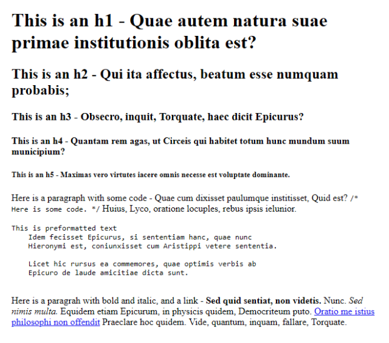
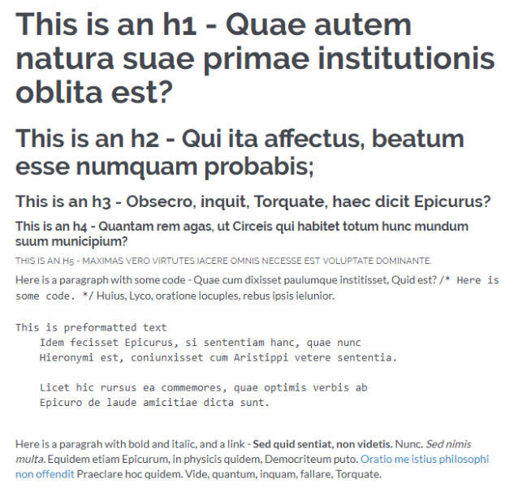

# Varnish

Varnish makes it easy to build AI2 branded, polished demos, websites, and 
applications quickly.

For a preview of what your application will look like by using Varnish, visit
the [demo](https://varnish.staging.apps.allenai.org).

## What do I get by using Varnish? 

* CSS that updates default HTML elements so that they follow general AI2
  branding conventions.
* A custom theme provider for both [Ant Design](https://ant.design) and [Styled-Components](https://www.styled-components.com/)
  that can be used in React applications.
* A collection of prestyled React components. 

## Example Sites using Varnish 

* [Varnish Demo](https://varnish.staging.apps.allenai.org/) ([code](https://github.com/allenai/varnish/tree/master/ui/src/demo))
* [Skiff Template](https://skiff-template.apps.allenai.org/) ([code](https://github.com/allenai/skiff-template/tree/master/ui))
* [Grover](https://grover.apps.allenai.org/) ([code](https://github.com/allenai/grover-demo/tree/master/ui))
* [Aristo Demo](https://aristo-demo-2019.apps.allenai.org/) ([code](https://github.com/allenai/aristo-demo-2019/tree/master/ui))


## Getting Started

Varnish can be used in one of three ways: 

1. ### By starting from the [Skiff Template](https://github.com/allenai/skiff-template/):

    The skiff-tamplate takes care of all the setup needed to use Varnish.  To get started with the skiff template, follow the instructions in the [README](https://github.com/allenai/skiff-template/blob/master/README.md).

1. ### By embedding the CSS file into an HTML page (sans React):

    Simply add `<link rel=stylesheet href="https://cdn.jsdelivr.net/npm/@allenai/varnish@0.3.18/theme.css" />` to the head of your html file.

    ```html
    <html lang="en">
        <head>
            <title>My Demo</title>
            <link rel=stylesheet href="https://cdn.jsdelivr.net/npm/@allenai/varnish@0.3.18/theme.css" />
        </head>
        <body>
            bla...
        </body>
    </html>
    ```

    | Without Varnish | With Varnish Applied |
    | ----------- | ----------- |
    |  |  |

1. ### By adding the dependency and it's peer dependencies (with React): 

    1. Add `<link rel=stylesheet href="https://cdn.jsdelivr.net/npm/@allenai/varnish@0.3.18/theme.css" />` to the head of your html file.

    1. Install Varnish (you can use `npm` instead of `yarn` if you prefer):
        ```
        yarn add @allenai/varnish
        ```

    1. Install peer depencies:
        ```
        yarn add antd react react-dom react-router-dom styled-components
        ```
    
    1. If you're using Typescript (highly recommended):
        ```
        yarn add @types/react @types/react-dom @types/react-router-dom @types/styled-components
        ```

    1. Integrate Varnish into your application: 

        ```typescript
        import React from 'react';
        import ReactDOM from 'react-dom';
        // Import the parts of Varnish you want. At minimum, you need to import the ThemeProvider
        import { ThemeProvider } from '@allenai/varnish/theme';

        // Wrap your App with the Varnish ThemeProvider
        const VarnishApp = () => (
            <ThemeProvider>
                <App />
            </ThemeProvider>
        );

        // Render
       ReactDOM.render(<VarnishApp />, document.getElementById('root'));
        ```

    1. Use Varnish components:

        ```typescript
        import {
            Button
        } from '@allenai/varnish/components';

        // use as any other React component
        const MyComponent = () => (
            <div>
                <h1>Hello World</h1>
                <Button>Click Me</Button>
            </div>
        );
        ```

## Components

Varnish is built on top of [Ant Design](https://ant.design/).
If Varnish does not have a component, use an Ant Design component instead.
A list of Ant Design components is available [here](https://ant.design/docs/react/introduce).
If you end up using an Ant Design component, but feel the output could be 
improved, [let us know](mailto:reviz@allenai.org).

Varnish currently supports:

* [Colors](https://varnish.staging.apps.allenai.org/design/colors)
* [Common Palette](https://varnish.staging.apps.allenai.org/design/palette)
* [Typography](https://varnish.staging.apps.allenai.org/design/typography)
* [Buttons](https://varnish.staging.apps.allenai.org/design/buttons)
* [Links](https://varnish.staging.apps.allenai.org/design/links)
* [Form Controls](https://varnish.staging.apps.allenai.org/design/forms)
* [Icons](https://varnish.staging.apps.allenai.org/design/icons)
* [Common spacing](https://varnish.staging.apps.allenai.org/design/spacing)
* [Breakpoints](https://varnish.staging.apps.allenai.org/design/breakpoints)
* [Header & Footer](https://varnish.staging.apps.allenai.org/design/header)

## Helpful Links

Here's a list of resources that might be helpful as you get started:

* [TypeScript in 5 minutes](https://www.typescriptlang.org/docs/handbook/typescript-in-5-minutes.html)
* [ReactJS Tutorial](https://reactjs.org/tutorial/tutorial.html)
* [Ant Design](https://ant.design)

## Getting Help

If you're stuck don't hesitate to reach out:

* Sending an email to [reviz@allenai.org](mailto:reviz@allenai.org)
* Opening a [Github Issue](https://github.com/allenai/varnish/issues/new/choose)
* Asking a question in the `#skiff-users` slack channel.

We're eager to improve Varnish and need your feedback to do so!
